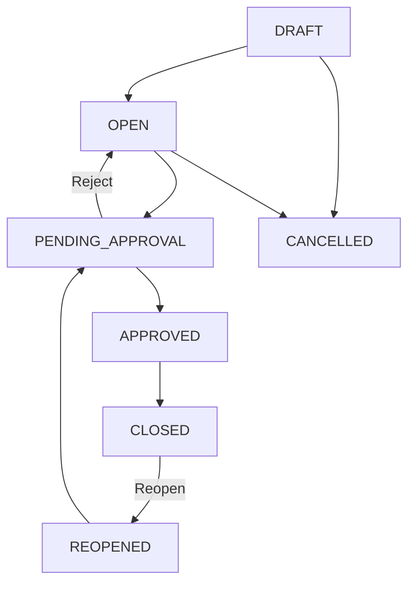
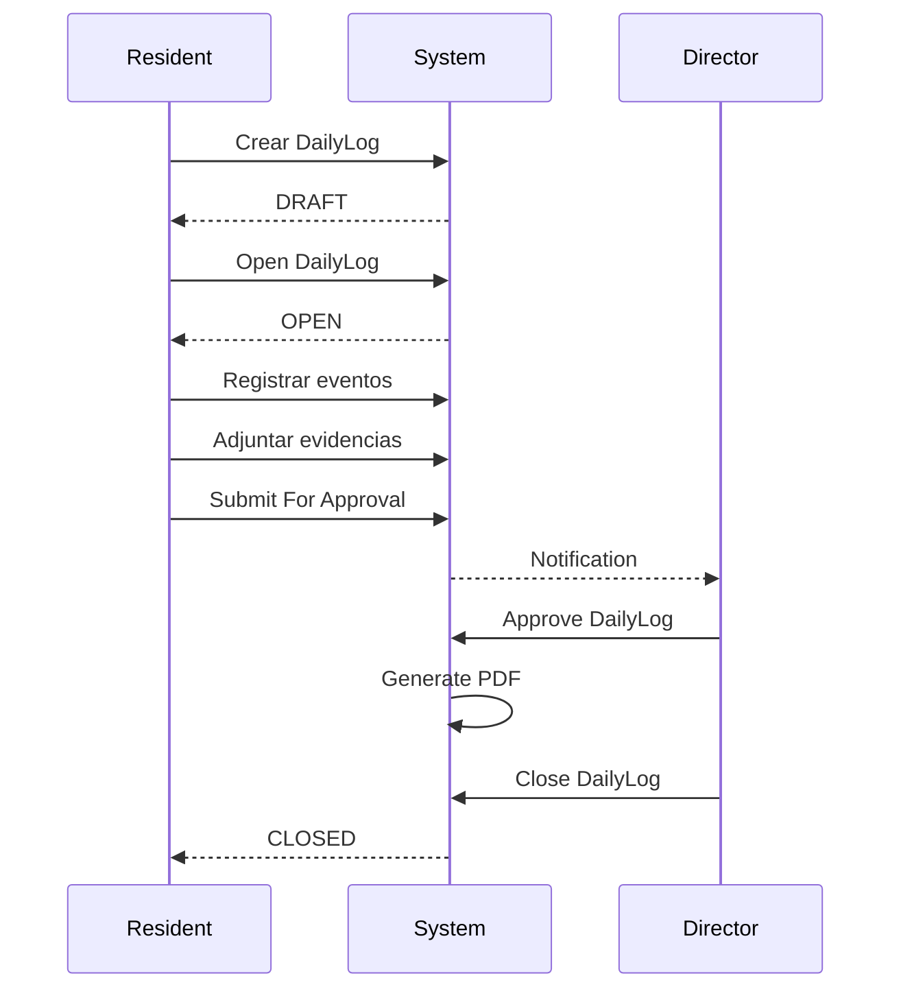
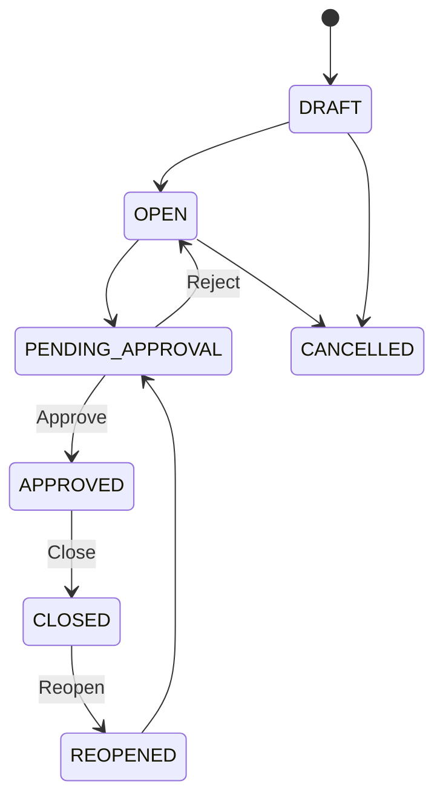
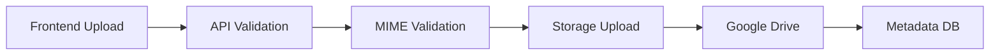
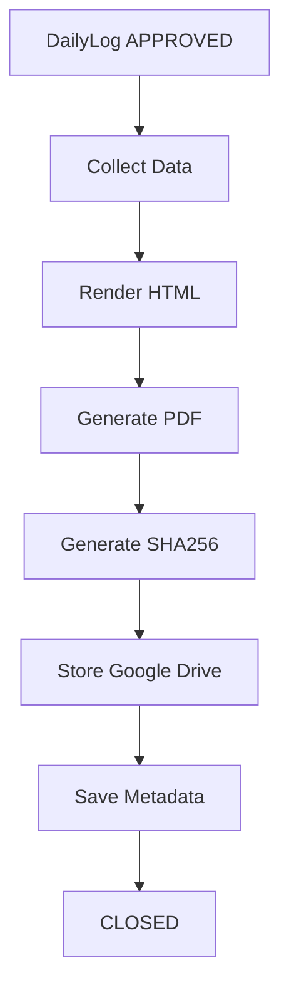
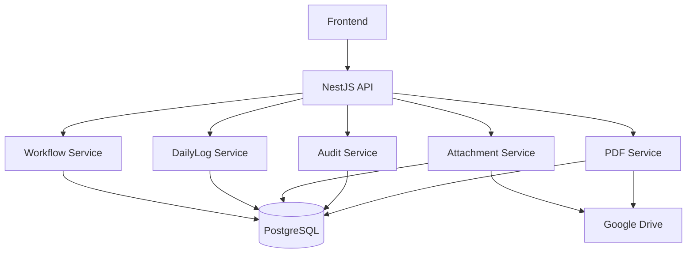
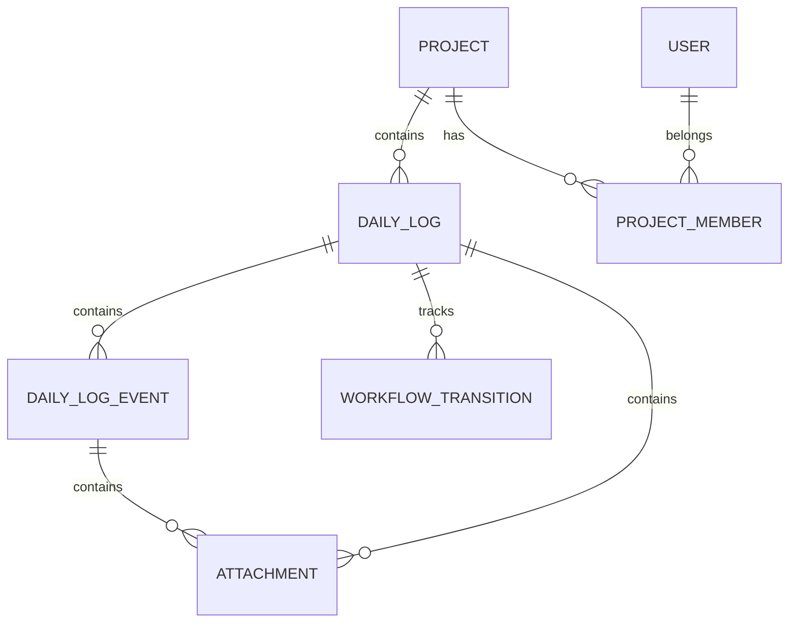
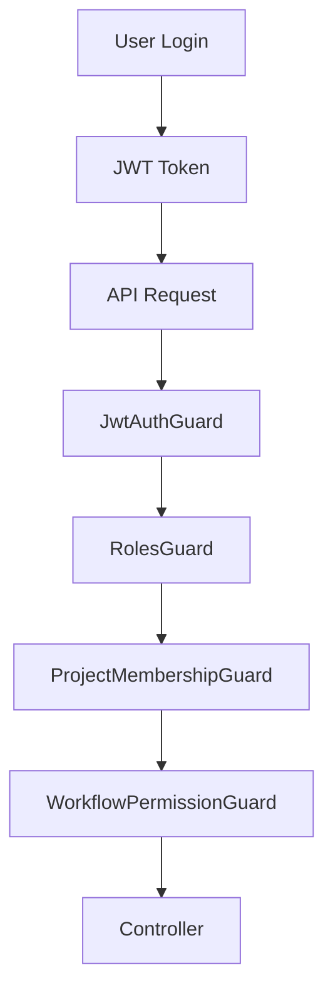
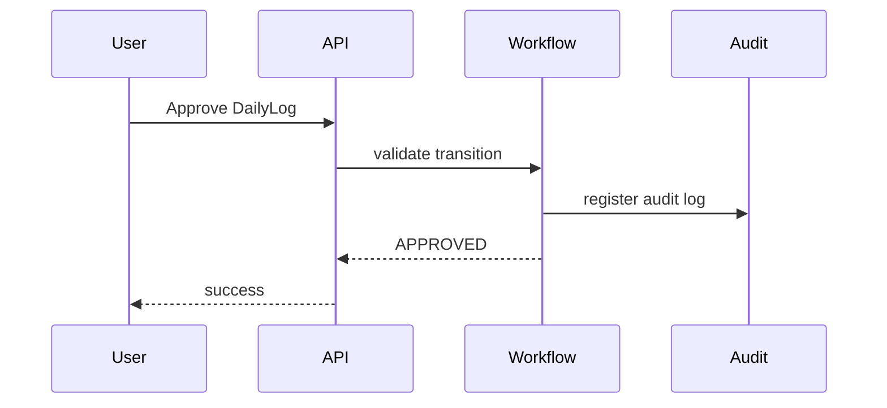

# DAILY_LOG_WORKFLOW_DIAGRAMS_V1

## Proyecto

Bitácora diaria de Obra Civil

## Ubicación recomendada del archivo

```text
C:\DEV\Bitacora de Obra\Documentation proyecto\08-diagrams\DAILY_LOG_WORKFLOW_DIAGRAMS_V1.md
```

---

# 1. Objetivo

Centralizar los diagramas funcionales y técnicos iniciales del workflow DailyLog.

Este documento servirá para:

- visualización arquitectura,
- alineación funcional,
- soporte frontend/backend,
- onboarding técnico,
- futuras presentaciones cliente.

---

# 2. Workflow principal

## Diagrama flujo general



---

# 3. Flujo operativo diario



---

# 4. Workflow aprobación



---

# 5. Flujo adjuntos



---

# 6. Flujo generación PDF



---

# 7. Arquitectura backend simplificada



---

# 8. Relación entidades principal



---

# 9. Flujo seguridad



---

# 10. Flujo auditoría



---

# 11. Diagramas futuros recomendados

## Arquitectura

- deployment diagram,
- infrastructure diagram,
- storage diagram.

---

## Workflow

- multi-step approvals,
- notifications flow,
- escalation flow.

---

## Frontend

- UI navigation maps,
- responsive layouts,
- component interaction diagrams.

---

# 12. Recomendación V1

Mantener diagramas sincronizados con:

- workflow real,
- APIs,
- entidades,
- seguridad,
- frontend.

Actualizar diagramas cuando exista:

- nuevo estado workflow,
- nueva integración,
- cambio arquitectura.
