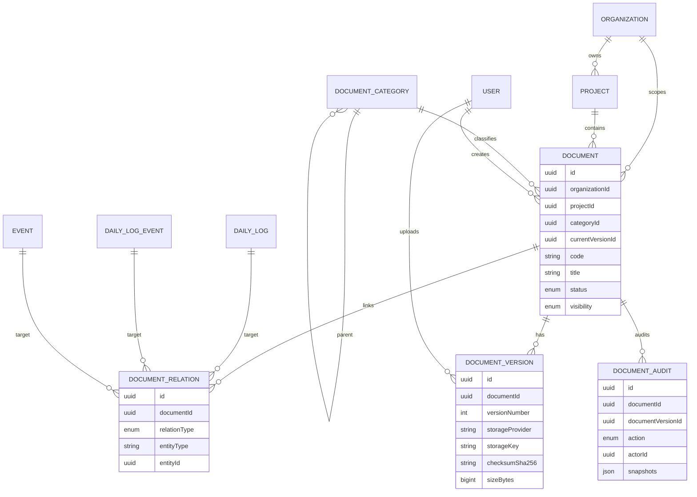

# FASE 65.0 - Document Management Enterprise Architecture

## Resumen ejecutivo

Esta fase define la arquitectura enterprise futura del modulo documental multi-proyecto para Bitacora de Obra Civil.

El sistema actual ya cuenta con control documental base:

- `Document` como metadata principal.
- `DocumentTypeCatalog` para tipos documentales.
- relaciones con `Project`, `DailyLog`, `Event`, `DailyLogDocument`, `EventDocument` y `DailyLogPdfVersion`.
- upload local controlado.
- descarga segura.
- auditoria de crear, subir, actualizar, borrar y descargar documentos.
- RBAC legacy e hibrido con permisos `documents:*`.

La arquitectura objetivo separa el documento logico de sus versiones fisicas, agrega categorias jerarquicas, relaciones documentales multi-entidad y auditoria documental especializada, sin almacenar binarios en PostgreSQL.

Esta fase solo documenta arquitectura. No crea migraciones, no modifica workflow `DailyLog`, no cambia RBAC actual y no implementa frontend complejo.

## Objetivo

Disenar un modulo documental enterprise que soporte:

- multiples proyectos y organizaciones.
- documentos independientes o ligados a bitacoras, eventos, PDFs, contratos y procesos futuros.
- versionamiento historico completo.
- almacenamiento externo en Google Drive o S3.
- trazabilidad/auditoria documental.
- RBAC documental compatible con RBAC v2.
- futura integracion con workflow documental.

## Estado actual

### Modelo actual

Entidad principal actual:

- `Document`

Campos actuales relevantes:

- `organizationId`
- `projectId`
- `dailyLogId`
- `eventId`
- `documentTypeId`
- `uploadedById`
- `type`
- `title`
- `description`
- `fileName`
- `storagePath`
- `storageProvider`
- `mimeType`
- `sizeBytes`
- `checksumSha256`
- `metadata`
- `version`
- `status`
- `deletedAt`

Relaciones actuales:

- `Document -> Organization`
- `Document -> Project`
- `Document -> DailyLog?`
- `Document -> Event?`
- `Document -> DocumentTypeCatalog`
- `Document -> User uploadedBy`
- `Document -> DailyLogDocument[]`
- `Document -> EventDocument[]`
- `Document -> DailyLogPdfVersion[]`

### Limitaciones actuales

- `Document` mezcla documento logico y archivo/version fisica.
- `version` es un entero simple, no una entidad historica.
- No existe `DocumentVersion`.
- No existe categoria jerarquica enterprise.
- Las relaciones documentales estan fragmentadas en tablas especializadas.
- Auditoria documental usa `AuditLog`, pero no existe `DocumentAudit` como vista/tabla especializada.
- Storage externo esta previsto por enum, pero no existe adaptador Google Drive/S3.
- Descarga usa archivo local.
- No existen URLs prefirmadas, thumbnails ni antivirus.
- No existe workflow documental de aprobacion/revision.

## Principios de arquitectura

1. PostgreSQL almacena metadata, indices, relaciones, auditoria y punteros de storage.
2. PostgreSQL no almacena binarios.
3. El documento logico vive separado de sus versiones fisicas.
4. Toda version fisica debe tener checksum, tamano, provider y storage key.
5. Toda accion documental sensible debe auditarse.
6. RBAC backend sigue siendo autoridad.
7. Frontend solo controla visibilidad y experiencia.
8. Todo documento pertenece al menos a una organizacion y normalmente a un proyecto.
9. Las relaciones a bitacoras, eventos, contratos u otras entidades deben ser genericas y extensibles.
10. El storage debe poder cambiar de local a Google Drive o S3 sin romper el dominio.

## Entidades objetivo

## Document

Representa el documento logico enterprise. No debe almacenar datos fisicos del archivo salvo referencia a version actual.

Campos propuestos:

```prisma
model Document {
  id                  String             @id @default(uuid()) @db.Uuid
  organizationId      String             @map("organization_id") @db.Uuid
  projectId           String?            @map("project_id") @db.Uuid
  categoryId          String?            @map("category_id") @db.Uuid
  currentVersionId    String?            @map("current_version_id") @db.Uuid
  code                String?            @db.VarChar(80)
  title               String             @db.VarChar(250)
  description         String?
  status              DocumentStatus     @default(DRAFT)
  visibility          DocumentVisibility @default(PROJECT)
  metadata            Json?              @db.JsonB
  createdById         String             @map("created_by") @db.Uuid
  updatedById         String?            @map("updated_by") @db.Uuid
  deletedById         String?            @map("deleted_by") @db.Uuid
  createdAt           DateTime           @default(now()) @map("created_at") @db.Timestamp(6)
  updatedAt           DateTime           @default(now()) @updatedAt @map("updated_at") @db.Timestamp(6)
  deletedAt           DateTime?          @map("deleted_at") @db.Timestamp(6)

  organization        Organization       @relation(fields: [organizationId], references: [id])
  project             Project?           @relation(fields: [projectId], references: [id])
  category            DocumentCategory?  @relation(fields: [categoryId], references: [id])
  currentVersion      DocumentVersion?   @relation("CurrentDocumentVersion", fields: [currentVersionId], references: [id])
  versions            DocumentVersion[]  @relation("DocumentVersions")
  relations           DocumentRelation[]
  audits              DocumentAudit[]

  @@unique([projectId, code], map: "uq_documents_project_code")
  @@index([organizationId], map: "idx_documents_organization")
  @@index([projectId], map: "idx_documents_project")
  @@index([categoryId], map: "idx_documents_category")
  @@index([status], map: "idx_documents_status")
  @@index([visibility], map: "idx_documents_visibility")
  @@map("documents")
}
```

Notas:

- `projectId` puede ser nullable solo para documentos organizacionales globales.
- `currentVersionId` apunta a la version vigente.
- `code` permite codificacion documental del cliente.
- `metadata` se reserva para atributos flexibles, no para reglas de autorizacion.

## DocumentVersion

Representa una version fisica inmutable de un documento.

Campos propuestos:

```prisma
model DocumentVersion {
  id              String                  @id @default(uuid()) @db.Uuid
  documentId      String                  @map("document_id") @db.Uuid
  versionNumber   Int                     @map("version_number")
  fileName        String                  @map("file_name") @db.VarChar(250)
  originalName    String?                 @map("original_name") @db.VarChar(250)
  mimeType        String?                 @map("mime_type") @db.VarChar(120)
  sizeBytes       BigInt?                 @map("size_bytes")
  checksumSha256  String?                 @map("checksum_sha256") @db.VarChar(64)
  storageProvider DocumentStorageProvider @default(LOCAL) @map("storage_provider")
  storageBucket   String?                 @map("storage_bucket") @db.VarChar(200)
  storageKey      String                  @map("storage_key")
  storageUrl      String?                 @map("storage_url")
  etag            String?                 @db.VarChar(250)
  uploadedById    String                  @map("uploaded_by") @db.Uuid
  uploadedAt      DateTime                @default(now()) @map("uploaded_at") @db.Timestamp(6)
  changeReason    String?                 @map("change_reason")
  metadata        Json?                   @db.JsonB

  document        Document                @relation("DocumentVersions", fields: [documentId], references: [id])
  uploadedBy      User                    @relation("DocumentVersionUploadedBy", fields: [uploadedById], references: [id])

  @@unique([documentId, versionNumber], map: "uq_document_versions_number")
  @@index([documentId], map: "idx_document_versions_document")
  @@index([checksumSha256], map: "idx_document_versions_checksum")
  @@map("document_versions")
}
```

Reglas:

- Una version no se edita despues de creada.
- Reemplazar archivo crea nueva version.
- Metadata del documento puede cambiar sin crear version si no cambia archivo.
- `storageKey` es la ruta/identificador interno, nunca debe exponerse sin control.
- `storageUrl` solo debe usarse si el provider lo requiere internamente; no debe ser URL publica permanente.

## DocumentCategory

Representa categorias documentales configurables por organizacion/proyecto.

Campos propuestos:

```prisma
model DocumentCategory {
  id             String           @id @default(uuid()) @db.Uuid
  organizationId String           @map("organization_id") @db.Uuid
  projectId      String?          @map("project_id") @db.Uuid
  parentId       String?          @map("parent_id") @db.Uuid
  code           String           @db.VarChar(80)
  name           String           @db.VarChar(150)
  description    String?
  status         RecordStatus     @default(ACTIVE)
  sortOrder      Int              @default(0) @map("sort_order")
  createdAt      DateTime         @default(now()) @map("created_at") @db.Timestamp(6)
  updatedAt      DateTime         @default(now()) @updatedAt @map("updated_at") @db.Timestamp(6)

  organization   Organization     @relation(fields: [organizationId], references: [id])
  project        Project?         @relation(fields: [projectId], references: [id])
  parent         DocumentCategory? @relation("DocumentCategoryTree", fields: [parentId], references: [id])
  children       DocumentCategory[] @relation("DocumentCategoryTree")
  documents      Document[]

  @@unique([organizationId, projectId, code], map: "uq_document_categories_scope_code")
  @@index([organizationId], map: "idx_document_categories_organization")
  @@index([projectId], map: "idx_document_categories_project")
  @@index([parentId], map: "idx_document_categories_parent")
  @@map("document_categories")
}
```

Uso:

- carpetas logicas.
- clasificacion por cliente.
- arbol documental.
- filtros por modulo.

## DocumentRelation

Relacion generica entre documento y cualquier entidad del dominio.

Campos propuestos:

```prisma
model DocumentRelation {
  id              String               @id @default(uuid()) @db.Uuid
  documentId      String               @map("document_id") @db.Uuid
  relationType    DocumentRelationType @map("relation_type")
  entityType      String               @map("entity_type") @db.VarChar(80)
  entityId        String               @map("entity_id") @db.Uuid
  projectId       String?              @map("project_id") @db.Uuid
  dailyLogId      String?              @map("daily_log_id") @db.Uuid
  metadata        Json?                @db.JsonB
  createdById     String               @map("created_by") @db.Uuid
  createdAt       DateTime             @default(now()) @map("created_at") @db.Timestamp(6)

  document        Document             @relation(fields: [documentId], references: [id])
  createdBy       User                 @relation("DocumentRelationCreatedBy", fields: [createdById], references: [id])

  @@unique([documentId, relationType, entityType, entityId], map: "uq_document_relations_target")
  @@index([documentId], map: "idx_document_relations_document")
  @@index([entityType, entityId], map: "idx_document_relations_entity")
  @@index([projectId], map: "idx_document_relations_project")
  @@index([dailyLogId], map: "idx_document_relations_daily_log")
  @@map("document_relations")
}
```

Entidades objetivo posibles:

- `Project`
- `DailyLog`
- `DailyLogEvent`
- `Event`
- `Document`
- `User`
- `Contract`
- `Organization`
- `WorkflowInstance`

## DocumentAudit

Auditoria especializada opcional para consultas documentales de alto volumen. Debe coexistir con `AuditLog`, no reemplazarlo inicialmente.

Campos propuestos:

```prisma
model DocumentAudit {
  id                String      @id @default(uuid()) @db.Uuid
  documentId        String      @map("document_id") @db.Uuid
  documentVersionId String?     @map("document_version_id") @db.Uuid
  action            AuditAction
  actorId           String?     @map("actor_id") @db.Uuid
  actorNameSnapshot String?     @map("actor_name_snapshot") @db.VarChar(200)
  actorEmailSnapshot String?    @map("actor_email_snapshot") @db.VarChar(200)
  projectSnapshot   Json?       @map("project_snapshot") @db.JsonB
  documentSnapshot  Json?       @map("document_snapshot") @db.JsonB
  versionSnapshot   Json?       @map("version_snapshot") @db.JsonB
  oldValue          Json?       @map("old_value") @db.JsonB
  newValue          Json?       @map("new_value") @db.JsonB
  metadata          Json?       @db.JsonB
  ipAddress         String?     @map("ip_address") @db.VarChar(80)
  userAgent         String?     @map("user_agent")
  createdAt         DateTime    @default(now()) @map("created_at") @db.Timestamp(6)

  document          Document    @relation(fields: [documentId], references: [id])

  @@index([documentId, createdAt], map: "idx_document_audit_document_created")
  @@index([documentVersionId], map: "idx_document_audit_version")
  @@index([action], map: "idx_document_audit_action")
  @@index([actorId], map: "idx_document_audit_actor")
  @@map("document_audit")
}
```

Decision recomendada:

- En primera implementacion, seguir registrando en `AuditLog`.
- Agregar `DocumentAudit` solo si el cliente requiere timeline documental dedicado, retencion diferenciada o consultas masivas.

## Enums objetivo

## DocumentStatus

Enum recomendado:

```prisma
enum DocumentStatus {
  DRAFT
  ACTIVE
  IN_REVIEW
  APPROVED
  REJECTED
  ARCHIVED
  SUPERSEDED
  DELETED
}
```

Uso:

- `DRAFT`: metadata creada, archivo pendiente o preparacion.
- `ACTIVE`: disponible sin aprobacion formal.
- `IN_REVIEW`: en revision documental.
- `APPROVED`: version/documento aprobado.
- `REJECTED`: rechazado por revision.
- `ARCHIVED`: historico disponible.
- `SUPERSEDED`: reemplazado por una version posterior.
- `DELETED`: borrado logico.

Compatibilidad actual:

- Hoy existen `ACTIVE`, `ARCHIVED`, `DELETED`.
- Los estados nuevos no deben activarse sin workflow documental.

## DocumentVisibility

Enum nuevo recomendado:

```prisma
enum DocumentVisibility {
  PRIVATE
  PROJECT
  ORGANIZATION
  PUBLIC_VERIFICATION
  RESTRICTED
}
```

Uso:

- `PRIVATE`: solo uploader/administrador o reglas OWN.
- `PROJECT`: usuarios con acceso al proyecto.
- `ORGANIZATION`: usuarios autorizados de la organizacion.
- `PUBLIC_VERIFICATION`: metadata minima para verificacion publica.
- `RESTRICTED`: documentos sensibles con permisos especificos.

## DocumentRelationType

Enum nuevo recomendado:

```prisma
enum DocumentRelationType {
  PRIMARY
  SUPPORT
  EVIDENCE
  GENERATED_PDF
  SIGNED_PDF
  CONTRACT
  DESIGN_PLAN
  PHOTO_SUPPORT
  LEGAL_SUPPORT
  REFERENCE
  REPLACES
  SUPERSEDES
}
```

Uso:

- `PRIMARY`: documento principal de una entidad.
- `SUPPORT`: soporte general.
- `EVIDENCE`: evidencia documental.
- `GENERATED_PDF`: PDF generado por workflow.
- `SIGNED_PDF`: PDF firmado.
- `REPLACES` / `SUPERSEDES`: relaciones entre documentos/versiones.

## ERD conceptual



## Estrategia de versionamiento

### Reglas base

- Crear documento con archivo crea `Document` + `DocumentVersion versionNumber=1`.
- Subir reemplazo crea nueva `DocumentVersion`.
- `Document.currentVersionId` apunta a la version vigente.
- Las versiones anteriores se conservan.
- La version anterior puede marcarse implicitamente como historica sin borrar storage.
- El cambio de metadata simple no crea version fisica.
- El cambio de archivo siempre crea version fisica.

### Numeracion

- Usar entero incremental por documento: `1`, `2`, `3`.
- Unicidad: `documentId + versionNumber`.
- Calculo dentro de transaccion.

### Integridad

- Validar checksum antes de persistir metadata.
- Si falla DB despues de subir archivo, borrar objeto o marcar objeto huerfano para cleanup.
- Si falla storage antes de DB, no crear version.
- Nunca sobrescribir `storageKey` de una version existente.

### Version vigente

Opciones:

1. `Document.currentVersionId`.
2. `DocumentVersion.isCurrent`.

Recomendacion:

- Usar `Document.currentVersionId` para lectura rapida.
- Evitar `isCurrent` para no mantener dos fuentes de verdad.

## Estrategia de almacenamiento Google Drive/S3

## Abstraccion StorageProvider

Crear interfaz futura:

```ts
type StoredObject = {
  provider: "LOCAL" | "GOOGLE_DRIVE" | "S3";
  bucket?: string;
  key: string;
  etag?: string;
  sizeBytes: number;
  checksumSha256: string;
};

interface DocumentStorageProvider {
  put(input: PutDocumentObjectInput): Promise<StoredObject>;
  getStream(key: string): Promise<NodeJS.ReadableStream>;
  getSignedDownloadUrl?(key: string, ttlSeconds: number): Promise<string>;
  deleteObject?(key: string): Promise<void>;
}
```

### S3

Estrategia:

- Bucket privado.
- Sin ACL publica.
- Object key deterministica:

```text
organizations/{organizationId}/projects/{projectId}/documents/{documentId}/versions/{versionNumber}/{uuid}-{fileName}
```

- Descargar por stream backend o URL prefirmada corta.
- Cifrado server-side: SSE-S3 o SSE-KMS.
- Versioning de bucket opcional, pero no sustituye `DocumentVersion`.
- Lifecycle policies para documentos archivados si cliente lo aprueba.

### Google Drive

Estrategia:

- Usar cuenta de servicio o OAuth workspace segun cliente.
- Carpeta raiz por organizacion/proyecto.
- Guardar `driveFileId` como `storageKey`.
- Guardar `driveFolderId` en metadata/storage bucket equivalente.
- No exponer links publicos permanentes.
- Descargar via backend o link temporal controlado si Google Drive lo permite bajo politica.
- Manejar cuotas, rate limits y permisos de Drive fuera del RBAC interno.

### Local

Mantener solo para desarrollo o despliegues pequenos:

```text
storage/documents/{projectId}/{yyyy}/{mm}/{uuid-fileName}
```

No recomendado como storage enterprise final salvo que exista volumen persistente, backup y antivirus.

### Seguridad storage

- Validar MIME, extension y magic bytes.
- Escanear antivirus antes de aprobar version.
- No publicar `storageKey`, `bucket`, `driveFileId`, rutas internas ni checksums completos en respuestas ordinarias.
- Calcular checksum SHA-256.
- Limitar tamano por categoria o tenant.
- Registrar descarga en auditoria.

## Reglas RBAC documentales

Permisos v2 recomendados:

| Permiso | Uso |
| --- | --- |
| `documents:read` | Leer metadata/listados. |
| `documents:create` | Crear documento y primera version. |
| `documents:update` | Editar metadata. |
| `documents:upload_version` | Subir nueva version. |
| `documents:approve` | Aprobar documento/version. |
| `documents:reject` | Rechazar documento/version. |
| `documents:archive` | Archivar documento. |
| `documents:delete` | Borrado logico. |
| `documents:download` | Descargar archivo. |
| `documents:manage_categories` | Administrar categorias. |
| `documents:audit` | Ver auditoria documental. |
| `documents:share` | Crear enlaces/relaciones de uso controlado. |

Compatibilidad actual:

- `documents:read` sigue cubriendo metadata y descarga legacy.
- `documents:download` ya existe en catalogo v2, pero no debe forzarse hasta ajustar roles.
- `documents:approve` ya existe en catalogo v2, pero sin workflow documental activo.

Scopes:

| Scope | Regla documental |
| --- | --- |
| `GLOBAL` | Todos los documentos. |
| `ORGANIZATION` | Documentos de organizacion. |
| `PROJECT` | Documentos del proyecto asignado. |
| `OWN` | Documentos creados/subidos por el usuario o asignados explicitamente. |

Reglas:

- `DocumentVisibility` no reemplaza RBAC.
- `RESTRICTED` exige permiso explicito o relacion de autorizacion adicional.
- Las descargas siempre deben validar proyecto/scope.
- Versiones heredaran permisos del documento padre.
- Auditoria puede requerir permiso separado.

## Reglas auditoria documental

Acciones auditables:

- `CREATE_DOCUMENT`
- `UPLOAD_DOCUMENT`
- `UPDATE_DOCUMENT`
- `DELETE_DOCUMENT`
- `DOWNLOAD_DOCUMENT`
- `ARCHIVE_DOCUMENT`
- `RESTORE_DOCUMENT`
- `DOCUMENT_VERSION_CREATED`
- `DOCUMENT_VERSION_APPROVED`
- `DOCUMENT_VERSION_REJECTED`
- `DOCUMENT_RELATION_CREATED`
- `DOCUMENT_RELATION_REMOVED`
- `DOCUMENT_CATEGORY_CREATED`
- `DOCUMENT_CATEGORY_UPDATED`
- `DOCUMENT_CATEGORY_DELETED`

Snapshots minimos:

- actor snapshot.
- document snapshot.
- version snapshot.
- project snapshot.
- relation snapshot.
- category snapshot.
- old/new values.
- storage metadata segura.

No auditar:

- contenido binario.
- base64.
- rutas locales absolutas.
- URLs prefirmadas.
- tokens.
- credenciales provider.

Formato metadata recomendado:

```json
{
  "entityType": "Document",
  "entityId": "uuid",
  "action": "DOCUMENT_VERSION_CREATED",
  "actor": {
    "id": "uuid",
    "nameSnapshot": "Nombre",
    "emailSnapshot": "correo@dominio.com"
  },
  "target": {
    "documentId": "uuid",
    "documentVersionId": "uuid",
    "projectId": "uuid"
  },
  "metadata": {
    "storageProvider": "S3",
    "mimeType": "application/pdf",
    "sizeBytes": 123456,
    "checksumSha256Prefix": "abc123..."
  },
  "timestamp": "ISO-8601"
}
```

## Endpoints REST futuros

### Documentos

| Metodo | Endpoint | Permiso |
| --- | --- | --- |
| `GET` | `/api/v1/documents` | `documents:read` |
| `POST` | `/api/v1/documents` | `documents:create` |
| `GET` | `/api/v1/documents/:id` | `documents:read` |
| `PATCH` | `/api/v1/documents/:id` | `documents:update` |
| `DELETE` | `/api/v1/documents/:id` | `documents:delete` |
| `POST` | `/api/v1/documents/:id/archive` | `documents:archive` |
| `POST` | `/api/v1/documents/:id/restore` | `documents:update` |

### Versiones

| Metodo | Endpoint | Permiso |
| --- | --- | --- |
| `GET` | `/api/v1/documents/:id/versions` | `documents:read` |
| `POST` | `/api/v1/documents/:id/versions/upload` | `documents:upload_version` |
| `GET` | `/api/v1/documents/:id/versions/:versionId` | `documents:read` |
| `GET` | `/api/v1/documents/:id/versions/:versionId/download` | `documents:download` |
| `POST` | `/api/v1/documents/:id/versions/:versionId/approve` | `documents:approve` |
| `POST` | `/api/v1/documents/:id/versions/:versionId/reject` | `documents:reject` |

### Relaciones

| Metodo | Endpoint | Permiso |
| --- | --- | --- |
| `GET` | `/api/v1/documents/:id/relations` | `documents:read` |
| `POST` | `/api/v1/documents/:id/relations` | `documents:update` |
| `DELETE` | `/api/v1/documents/:id/relations/:relationId` | `documents:update` |

### Categorias

| Metodo | Endpoint | Permiso |
| --- | --- | --- |
| `GET` | `/api/v1/document-categories` | `documents:read` |
| `POST` | `/api/v1/document-categories` | `documents:manage_categories` |
| `PATCH` | `/api/v1/document-categories/:id` | `documents:manage_categories` |
| `DELETE` | `/api/v1/document-categories/:id` | `documents:manage_categories` |

### Auditoria

| Metodo | Endpoint | Permiso |
| --- | --- | --- |
| `GET` | `/api/v1/documents/:id/audit` | `documents:audit` |
| `GET` | `/api/v1/documents/:id/versions/:versionId/audit` | `documents:audit` |

### Storage

| Metodo | Endpoint | Permiso |
| --- | --- | --- |
| `POST` | `/api/v1/documents/:id/versions/:versionId/signed-download-url` | `documents:download` |
| `POST` | `/api/v1/documents/upload-session` | `documents:create` |

Nota:

- URLs prefirmadas deben tener TTL corto y auditarse.
- Upload directo a S3/Drive requiere sesion de carga y confirmacion backend posterior.

## Integracion futura con workflow documental

Fase futura, no activar ahora:

- `DocumentStatus.IN_REVIEW`
- `DocumentStatus.APPROVED`
- `DocumentStatus.REJECTED`
- comentarios de revision.
- aprobadores por rol/proyecto.
- bloqueo de descarga o uso de versiones no aprobadas.
- generacion de PDF final ligada a version aprobada.

Reglas candidatas:

- Solo versiones `APPROVED` pueden marcarse como evidencia final.
- Un documento `RESTRICTED` requiere `documents:read` + permiso especifico o rol asignado.
- Una version rechazada no debe ser currentVersion.
- Cerrar bitacora podria relacionar `GENERATED_PDF` y `SIGNED_PDF` como `DocumentRelation`, pero no se modifica workflow actual.

## Compatibilidad multi-proyecto

Reglas:

- `Document.projectId` define scope primario cuando existe.
- `Document.organizationId` siempre define tenant.
- `DocumentRelation.projectId` ayuda a filtrar relaciones por proyecto sin resolver entidad destino.
- Un documento no debe relacionarse con entidades de otro proyecto salvo permiso `ORGANIZATION` o `GLOBAL` y regla explicita.
- Para documentos compartidos entre proyectos, usar `visibility=ORGANIZATION` y relaciones multiples, no duplicar binarios.

Casos:

- documento de contrato compartido por varios proyectos: `ORGANIZATION` + varias relaciones.
- evidencia de evento: `PROJECT` + relation a `DailyLogEvent`.
- PDF final de bitacora: `PROJECT` + relation `GENERATED_PDF` a `DailyLog`.

## Riesgos arquitectonicos

| Riesgo | Impacto | Mitigacion |
| --- | --- | --- |
| Mezclar documento logico y archivo fisico. | Versionamiento fragil. | Separar `Document` y `DocumentVersion`. |
| Exponer rutas o storage keys. | Filtracion de infraestructura. | Sanitizar respuestas y auditar descargas. |
| Usar links publicos permanentes. | Acceso no revocable. | URLs prefirmadas con TTL corto o stream backend. |
| Confiar solo en MIME declarado. | Subida de archivo peligroso. | MIME + extension + magic bytes + antivirus. |
| Borrar fisicamente versiones. | Perdida historica. | Soft delete/logical archive y retencion. |
| Reemplazar workflow daily log accidentalmente. | Regresion operacional. | Integracion documental futura y separada. |
| Activar `documents:download` sin backfill. | Usuarios pierden descarga. | Compatibilidad legacy hasta matriz aprobada. |
| Google Drive rate limits. | Fallos de carga/descarga. | Retry, backoff, cuotas y fallback. |
| S3 object orphan si falla DB. | Costos y basura operacional. | Transacciones compensatorias y job cleanup. |
| Multi-proyecto con relaciones cruzadas. | Fuga de documentos entre proyectos. | Validar tenant/proyecto en cada relation. |

## Decisiones tecnicas pendientes

1. Storage enterprise final: S3, Google Drive o ambos.
2. Si `DocumentAudit` se implementa como tabla dedicada o se mantiene `AuditLog`.
3. Si categorias son por organizacion, proyecto o ambas.
4. Si documentos organizacionales sin `projectId` se permiten desde la primera version enterprise.
5. Politica de versionamiento: version por archivo solamente o tambien por metadata critica.
6. Antivirus requerido y proveedor.
7. Tamano maximo por archivo y por proyecto.
8. Retencion documental y borrado fisico.
9. Reglas de documentos restringidos.
10. Workflow documental: aprobacion simple o multiaprobador.
11. Si descargas usan stream backend o URL prefirmada.
12. Mapeo final RBAC documental segun matriz cliente.

## Roadmap recomendado

### FASE 65.1 - Modelo tecnico documental

- Definir migraciones propuestas para `DocumentVersion`, `DocumentCategory`, `DocumentRelation`.
- Decidir si `DocumentAudit` se agrega o se deriva de `AuditLog`.
- No activar workflow documental.

### FASE 65.2 - Storage provider abstraction

- Crear interfaz de storage.
- Mantener local como provider actual.
- Preparar S3/Google Drive sin cambiar UX.

### FASE 65.3 - Versionamiento documental

- Implementar versiones fisicas.
- Migrar documentos actuales a version 1.
- Mantener descarga compatible.

### FASE 65.4 - Relaciones documentales enterprise

- Migrar relaciones actuales `DailyLogDocument` y `EventDocument` hacia `DocumentRelation` o mantener coexistencia temporal.
- Agregar relacion a `DailyLogEvent`.

### FASE 65.5 - RBAC y auditoria documental

- Ajustar permisos documentales v2.
- Auditar versiones, relaciones, categorias y descargas.
- Validar scopes multi-proyecto.

### FASE 65.6 - Frontend documental enterprise

- Listado con categorias, versiones y relaciones.
- Visor/preview autenticado.
- Timeline documental.
- Sin activar workflow final salvo aprobacion.

## Validaciones de arquitectura

### Consistencia con modulos actuales

- Evoluciona `Document` actual sin eliminarlo.
- Respeta `ProjectAccessPolicy`.
- Mantiene relacion con `DailyLog` y eventos actuales.
- No modifica `DailyLog` workflow.
- No rompe `DailyLogPdfVersion`.

### Compatibilidad con auditoria existente

- Reusa `AuditLog` como fuente inicial.
- Propone `DocumentAudit` como extension opcional.
- Mantiene snapshots y metadata segura.

### Compatibilidad multi-proyecto

- Usa `organizationId` como tenant.
- Usa `projectId` como scope primario.
- Permite documentos organizacionales.
- Usa `DocumentRelation` para relaciones multiples.

### Compatibilidad workflow documental futuro

- Agrega estados candidatos sin activarlos.
- Permite aprobacion/rechazo por version.
- Permite relacionar versiones aprobadas con bitacoras o eventos.

## Restricciones confirmadas

- No se implementa frontend complejo.
- No se crean migraciones.
- No se modifica workflow `DailyLog`.
- No se rompe RBAC actual.
- No se almacenan archivos binarios en PostgreSQL.
- No se activan reglas finales de workflow documental.

## Conclusion

La arquitectura propuesta convierte el control documental actual en una base enterprise multi-proyecto: documento logico, versiones inmutables, categorias, relaciones genericas, auditoria especializada y storage desacoplado.

El siguiente paso recomendado es disenar el modelo tecnico/migraciones en una fase separada, con decision previa sobre storage enterprise y alcance RBAC documental final.
